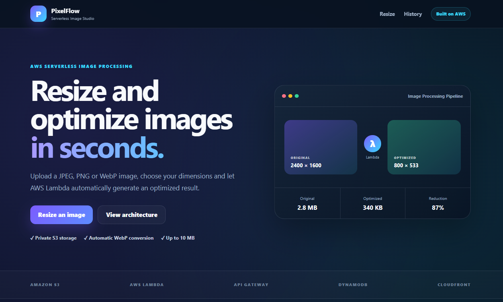
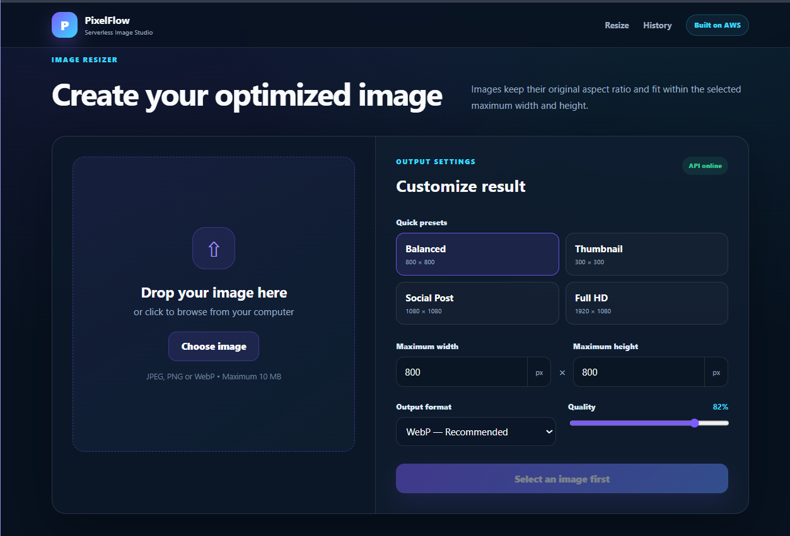
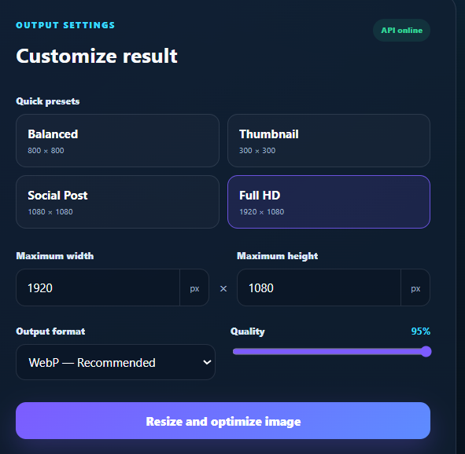
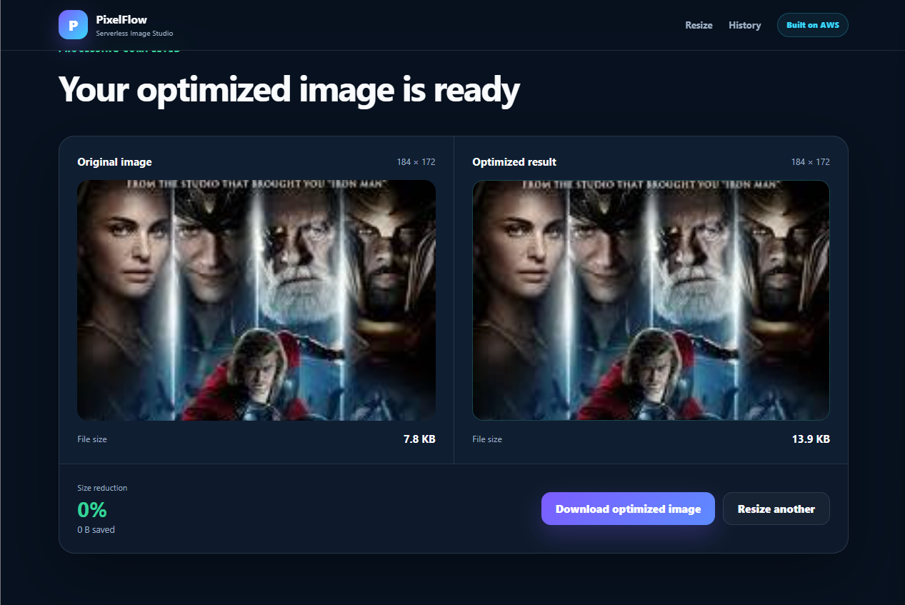
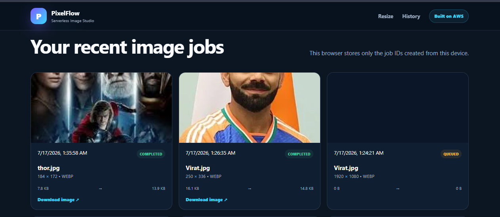
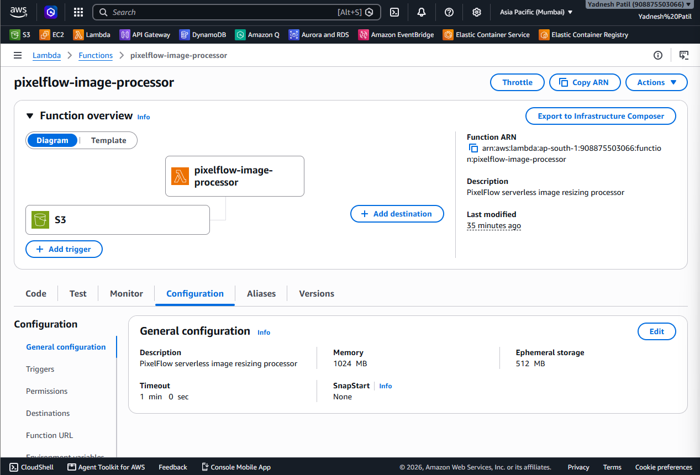

# PixelFlow — Serverless Image Resizer

PixelFlow is an AWS serverless application that automatically resizes
and optimizes uploaded images.

## Planned AWS Services

- Amazon S3
- AWS Lambda
- Amazon API Gateway
- Amazon DynamoDB
- Amazon CloudFront
- AWS IAM

## Status

Project development in progress.

<!-- SCREENSHOTS_START -->

---

## Application Screenshots

  <strong>PixelFlow — AWS Serverless Image Resizer</strong>

  Upload, resize, convert and optimize images through an event-driven AWS pipeline.

### Application Interface

<table>
  <tr>
    <td width="50%" align="center">
      <strong>PixelFlow Home Page</strong>
        
      
    </td>
    <td width="50%" align="center">
      <strong>Image Selection and Preview</strong>
        
      
    </td>
  </tr>

  <tr>
    <td width="50%" align="center">
      <strong>Resize and Output Settings</strong>
        
      
    </td>
    <td width="50%" align="center">
      <strong>Optimized Processing Result</strong>
        
      
    </td>
  </tr>
</table>

### Processing History and AWS Deployment

<table>
  <tr>
    <td width="50%" align="center">
      <strong>Recent Processing Jobs</strong>
        
      
    </td>
    <td width="50%" align="center">
      <strong>AWS Lambda Image Processor</strong>
        
      
    </td>
  </tr>
</table>

  <em>
    Images are uploaded using presigned S3 forms, processed by a
    container-based AWS Lambda function using Pillow, and tracked in DynamoDB.
  </em>

<!-- SCREENSHOTS_END -->
